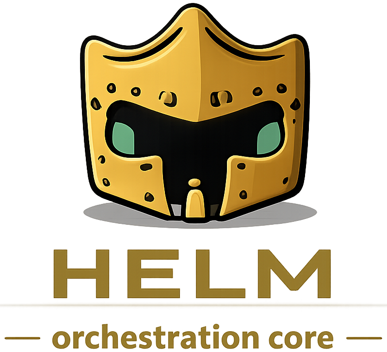

<p align="center">
  
  <br/>
  <span style="font-size:1.25em;"><i>Build, compose and run intelligent workflows across agents</i></span>
</p>

# Helm

**Extensible agent orchestration engine for VS Code Copilot.**

## What is Helm?

Helm transforms VS Code Copilot from a single monolithic AI into a coordinated team of specialized agents. It's a framework of agent definition files (`.agent.md`) and orchestration rules that implement hierarchical, generative multi-agent orchestration — where tasks are routed to the right specialist, executed in structured phases, and new agents are created on demand when no existing role fits.

Each agent has a defined identity, expertise, constraints, and communication style. ARTHUR, the chief orchestrator, dispatches work, enforces delegation protocols, and ensures research happens before planning, and planning before execution. The result is structured, repeatable AI-assisted development with clear accountability at every step.

Helm is not a library or runtime. It's a set of conventions and agent definitions that run entirely within VS Code's Copilot agent infrastructure.

> **Theme:** The default team uses an Arthurian theme — ARTHUR, MERLIN, SCOOP, SAGE, QUILL. These are just names. You can rename any agent to fit your team's personality by editing their `.agent.md` file and the roster.

## The Core Team

| Agent | Role | Tagline |
|-------|------|---------|
| **ARTHUR** | Chief Orchestrator | *"The conductor who never plays an instrument."* |
| **MERLIN** | HR Director | *"Every team deserves its architect."* |
| **SCOOP** | Senior Researcher | *"The truth is in the details others skip."* |
| **SAGE** | Strategic Planner | *"A good plan makes implementation feel inevitable."* |
| **QUILL** | Technical Documentation Writer | *"Clear docs are the shortest distance between a developer and a working feature."* |
| **PROBE** | Test Runner | *"X/Y passed. Z failures."* |

**ARTHUR** never produces deliverables directly — he routes every task to the right agent and tracks progress. **MERLIN** creates new agents by researching role requirements and designing purpose-built personas. **SCOOP** deep-dives into any topic, with every report including a "What Most People Miss" section. **SAGE** builds phased implementation plans with dependency analysis and risk identification. **QUILL** writes developer-facing documentation, running "The Confused Developer Test" on every section. **PROBE** runs automated behavioral tests against the agent system, evaluating pass/fail criteria and producing clean reports.

> **Note:** The core team is deliberately infrastructure — orchestration, research, planning, hiring, and documentation. There are no implementation agents in the default roster. When a plan calls for a skillset not covered, ARTHUR engages MERLIN to hire the right specialist (e.g., a TypeScript engineer, a database migration expert, a social publisher) on the fly. This keeps the core team lean and ensures implementation agents are purpose-built for the actual work, not generic.

## How It Works

ARTHUR routes every task through one of three complexity tiers:

### Research Path

For understanding, not building. Triggered by words like "research", "compare", "evaluate", or "investigate".

SCOOP investigates the topic and returns findings directly. No spec folder or plan required.

### Standard Path

The default for multi-file, multi-agent work.

SAGE creates a plan → **user approves** → ARTHUR hires implementation agents via MERLIN as needed → ARTHUR executes phases, dispatching agents in parallel where possible → completion report.

### Full Path

For new features, migrations, or rewrites. Triggered by "create a spec", "plan this", or similar.

SCOOP researches → SAGE writes a spec → **user approves** → SAGE writes a phased plan → **user approves** → ARTHUR hires implementation agents via MERLIN as needed → ARTHUR executes phases, dispatching agents in parallel where possible → completion report.

The Full Path includes mandatory human approval gates. ARTHUR cannot proceed past spec or plan creation without explicit user confirmation.

## Dynamic Agent Creation

When no existing team member fits a task, ARTHUR identifies the gap and engages MERLIN. MERLIN delegates to SCOOP to research the role requirements, then designs a new agent — complete with persona, skills, constraints, and communication style. The agent is written as a `.agent.md` file and can be permanent (added to the roster) or temporary (archived after task completion).

## Skills

Agents draw on **skills** — reusable instruction sets that encode domain-specific workflows and best practices. Each skill lives in its own folder under `.github/skills/` with a `SKILL.md` file. When a task matches a skill's domain, the agent loads the skill before starting work.

The default skill set covers the full orchestration lifecycle:

| Skill | Used by | Purpose |
|-------|---------|--------|
| `orchestrate-delegation` | ARTHUR | Complexity routing, parallel dispatch, human checkpoints |
| `conduct-research` | SCOOP | Investigation planning, source triage, confidence flagging |
| `create-spec` | SAGE | Feature specification authoring |
| `create-plan` | SAGE | Phased implementation planning with dependency annotations |
| `write-technical-docs` | QUILL | Doc-type selection, plan-draft-review loop, code-sample discipline |
| `hire-agent` | MERLIN | Role intake, persona design, agent-file authoring |
| `archive-agent` | MERLIN | Temp agent offboarding and re-archival |
| `design-test-rubric` | PROBE | Scorecard weighting, severity taxonomy, violation-log schema |
| `run-test-plan` | PROBE | Test execution, stdout/stderr capture, pass/fail reporting |
| `skill-creator` | Any | Meta-skill for authoring, editing, and benchmarking new skills |

Skills are composable — an agent can load multiple skills for a single task. New skills can be authored using the `skill-creator` skill.

The **Skills Roster** (`.github/skills-roster.md`) tracks every skill in the system — its purpose, which agents use it, the last validation date, and any warnings from the validator. Every skill must pass `validate_skill.py` (`.github/scripts/`) with zero errors before it is considered complete. Run the validator after creating or modifying any skill to keep the roster current.

## Key Features

- **Strict role boundaries** — agents have defined responsibilities and constraints, preventing scope creep
- **Human checkpoints** — mandatory approval gates in the Standard and Full Paths before execution begins
- **Parallel dispatch** — independent tasks run simultaneously across multiple agents, with file conflict rules to prevent collisions
- **Generative hiring** — new agents are created on demand when existing roles don't cover a task
- **Session and repo memory** — agents build continuity across conversations through persistent memory files
- **Structured artifacts** — every effort produces artifacts in numbered spec folders (`artifacts/spec###-short-name/`)
- **Research-first protocol** — delegation rules enforce research before planning, and planning before execution

## Developer Workflow

Use these tools to maintain code quality and system health while working within the Helm ecosystem.

### How do I check for errors?

The `get_errors` tool provides a fast, semantics-aware check for compile or lint errors. Use it after every file edit to ensure your changes are valid before proceeding.

**Check specific files:**

```powershell
# Check one or more specific files (absolute paths recommended)
get_errors --filePaths "C:\path\to\file.ts", "C:\path\to\other.ts"
```

**Check the entire workspace:**

```powershell
# Omit filePaths to scan the entire workspace
get_errors
```

> **Note:** Always run `get_errors` after creating or editing any file (including tests) to catch type errors and syntax issues proactively.

## Project Structure

```
AGENTS.md                  # Always-on shared context for all agents
.github/
  copilot-instructions.md  # Bootstrap — loads ARTHUR's identity
  team-roster.md           # Active and archived team members
  agents/                  # Agent definition files
    arthur.agent.md
    merlin.agent.md
    sage.agent.md
    scoop.agent.md
    quill.agent.md
    probe.agent.md
    temps/                 # Archived temporary agents
  skills/                  # Reusable skill definitions (one SKILL.md per folder)
    orchestrate-delegation/
    conduct-research/
    create-spec/
    create-plan/
    write-technical-docs/
    hire-agent/
    archive-agent/
    design-test-rubric/
    run-test-plan/
    skill-creator/
  templates/               # Plan and spec templates
  scripts/                 # Utility scripts
artifacts/                 # Spec folders created per-effort (spec001-*, spec002-*, etc.)
  docs/                    # Standalone documentation (not tied to a spec)
```

> **Note:** Active temporary agents (hired for specific tasks) also appear in `.github/agents/` while they are in use. Check the [team roster](.github/team-roster.md) for the current list.

## Getting Started

Helm is a VS Code Copilot agent orchestration system. To use it:

1. **Requirements** — VS Code with GitHub Copilot (Chat) installed and active. Crucially, **you must enable** `chat.subagents.allowInvocationsFromSubagents` in your VS Code settings, or the multi-agent routing will silently fail.
2. **Add to workspace** — Copy the `.github` folder into your project workspace. The `.github/copilot-instructions.md` file bootstraps the orchestration system automatically when Copilot reads the workspace.
3. **Start a conversation** — Address ARTHUR (the default) or select a specific agent. Describe your task and ARTHUR routes it through the appropriate complexity path.

No build steps, no dependencies, no installation. The agent definitions are the product.

## Model Compatibility

Helm works with both reasoning models (e.g., Claude Opus 4.6, GPT-5.3-Codex) and non-reasoning models (e.g., GPT-4.1). Since Copilot users often have limited premium requests, the orchestration system is designed to function across model tiers without breaking down. Non-reasoning models may require more explicit prompting to output similar quality results.

## Testing

A comprehensive behavioral test plan is included at [`artifacts/testing/test-plan.md`](artifacts/testing/test-plan.md) with 83 test cases across 12 categories. Because Helm has no runtime, tests are conversational — you send a prompt, observe what the agents say and do, and verify the outcome. The plan covers all three execution paths, both approval gates, the dynamic hiring chain, parallel dispatch, constraint enforcement, memory behavior, error recovery, artifact naming, the temporary agent lifecycle, status-query handling, and workflow hygiene.

Of the 83 tests, 34 are marked 🤖 (automatable) and can be run by **PROBE**, the test runner agent. Use `@PROBE run all` to execute all automatable tests, or `@PROBE run TC-XXX` for a specific test. PROBE calls target agents as subagents, evaluates responses against pass criteria, checks file system side effects, and cleans up all artifacts. The remaining 49 tests are manual (👤) and require multi-turn interaction or environment changes.

If you want to quickly verify the engine is working without running the full suite, the test plan opens with a **Smoke Test** section — seven targeted prompts that exercise every critical system: routing, delegation, approval gates, nested agent calls, direct addressing, and constraint enforcement.

## Portability

Helm is built for VS Code Copilot's agent infrastructure, specifically its subagent dispatch system. The orchestration patterns — research before planning, planning before execution, human checkpoints, dynamic hiring — are transferable concepts, but the implementation depends on Copilot's `runSubagent` capability. Other tools (Claude Code, Codex CLI, Gemini) can use the instruction files and agent personas, but multi-agent routing will need to be adapted to each platform's capabilities.

## License

MIT — Copyright (c) 2026 Smartmarbles.com
