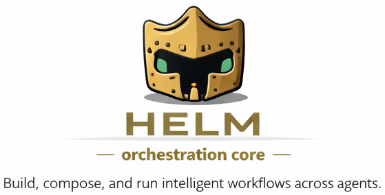

<p align="center">
  
</p>

# Helm

**Extensible agent orchestration engine for VS Code Copilot.**

## What is Helm?

Helm transforms VS Code Copilot from a single monolithic AI into a coordinated team of specialized agents. It's a framework of agent definition files (`.agent.md`) and orchestration rules that implement hierarchical, generative multi-agent orchestration — where tasks are routed to the right specialist, executed in structured phases, and new agents are created on demand when no existing role fits.

Each agent has a defined identity, expertise, constraints, and communication style. ARTHUR, the chief orchestrator, dispatches work, enforces delegation protocols, and ensures research happens before planning, and planning before execution. The result is structured, repeatable AI-assisted development with clear accountability at every step.

Helm is not a library or runtime. It's a set of conventions and agent definitions that run entirely within VS Code's Copilot agent infrastructure.

## The Core Team

| Agent | Role | Tagline |
|-------|------|---------|
| **ARTHUR** | Chief Orchestrator | *"The conductor who never plays an instrument."* |
| **MERLIN** | HR Director | *"Every team deserves its architect."* |
| **SCOOP** | Senior Researcher | *"The truth is in the details others skip."* |
| **SAGE** | Strategic Planner | *"A good plan makes implementation feel inevitable."* |
| **QUILL** | Technical Documentation Writer | *"Clear docs are the shortest distance between a developer and a working feature."* |

**ARTHUR** never produces deliverables directly — he routes every task to the right agent and tracks progress. **MERLIN** creates new agents by researching role requirements and designing purpose-built personas. **SCOOP** deep-dives into any topic, with every report including a "What Most People Miss" section. **SAGE** builds phased implementation plans with dependency analysis and risk identification. **QUILL** writes developer-facing documentation, running "The Confused Developer Test" on every section.

> **Theme:** The default team uses an Arthurian theme — ARTHUR, MERLIN, SCOOP, SAGE, QUILL. These are just names. You can rename any agent to fit your team's personality by editing their `.agent.md` file and the roster.

> **Note:** The core team is deliberately infrastructure — orchestration, research, planning, hiring, and documentation. There are no implementation agents in the default roster. When a plan calls for a skillset not covered, ARTHUR engages MERLIN to hire the right specialist (e.g., a TypeScript engineer, a database migration expert, a social publisher) on the fly. This keeps the core team lean and ensures implementation agents are purpose-built for the actual work, not generic.

## How It Works

ARTHUR routes every task through one of three complexity tiers:

### Research Path

For understanding, not building. Triggered by words like "research", "compare", "evaluate", or "investigate".

SCOOP investigates the topic and returns findings directly. No spec folder or plan required.

### Standard Path

The default for multi-file, multi-agent work.

SAGE creates a plan → **user approves** → ARTHUR hires implementation agents via MERLIN as needed → ARTHUR executes phases, dispatching agents in parallel where possible → completion report.

### Full Path

For new features, migrations, or rewrites. Triggered by "create a spec", "plan this", or similar.

SCOOP researches → SAGE writes a spec → **user approves** → SAGE writes a phased plan → **user approves** → ARTHUR hires implementation agents via MERLIN as needed → ARTHUR executes phases, dispatching agents in parallel where possible → completion report.

The Full Path includes mandatory human approval gates. ARTHUR cannot proceed past spec or plan creation without explicit user confirmation.

## Dynamic Agent Creation

When no existing team member fits a task, ARTHUR identifies the gap and engages MERLIN. MERLIN delegates to SCOOP to research the role requirements, then designs a new agent — complete with persona, skills, constraints, and communication style. The agent is written as a `.agent.md` file and can be permanent (added to the roster) or temporary (archived after task completion).

## Key Features

- **Strict role boundaries** — agents have defined responsibilities and constraints, preventing scope creep
- **Human checkpoints** — mandatory approval gates in the Standard and Full Paths before execution begins
- **Parallel dispatch** — independent tasks run simultaneously across multiple agents, with file conflict rules to prevent collisions
- **Generative hiring** — new agents are created on demand when existing roles don't cover a task
- **Session and repo memory** — agents build continuity across conversations through persistent memory files
- **Structured artifacts** — every effort produces artifacts in numbered spec folders (`artifacts/spec###-short-name/`)
- **Research-first protocol** — delegation rules enforce research before planning, and planning before execution

## Project Structure

```
.github/
  agents/                # Agent definition files
    arthur.agent.md
    merlin.agent.md
    sage.agent.md
    scoop.agent.md
    quill.agent.md
    team-roster.md
    temps/               # Archived temporary agents
  templates/             # Plan and spec templates
    plan-template.md
    spec-template.md
  copilot-instructions.md  # Entry point / bootstrap
artifacts/               # Spec folders created per-effort (spec001-*, spec002-*, etc.)
```

## Getting Started

Helm is a VS Code Copilot agent orchestration system. To use it:

1. **Requirements** — VS Code with GitHub Copilot (Chat) installed and active. Crucially, **you must enable** `chat.subagents.allowInvocationsFromSubagents` in your VS Code settings, or the multi-agent routing will silently fail.
2. **Add to workspace** — Copy the `.github` folder into your project workspace. The `.github/copilot-instructions.md` file bootstraps the orchestration system automatically when Copilot reads the workspace.
3. **Start a conversation** — Address ARTHUR (the default) or select a specific agent. Describe your task and ARTHUR routes it through the appropriate complexity path.

No build steps, no dependencies, no installation. The agent definitions are the product.

## Model Compatibility

Helm works with both reasoning models (e.g., Claude Opus 4.6, GPT-5.3-Codex) and non-reasoning models (e.g., GPT-4.1). Since Copilot users often have limited premium requests, the orchestration system is designed to function across model tiers without breaking down. Non-reasoning models may require more explicit prompting to output similar quality results.

## License

MIT — Copyright (c) 2026 Smartmarbles.com
